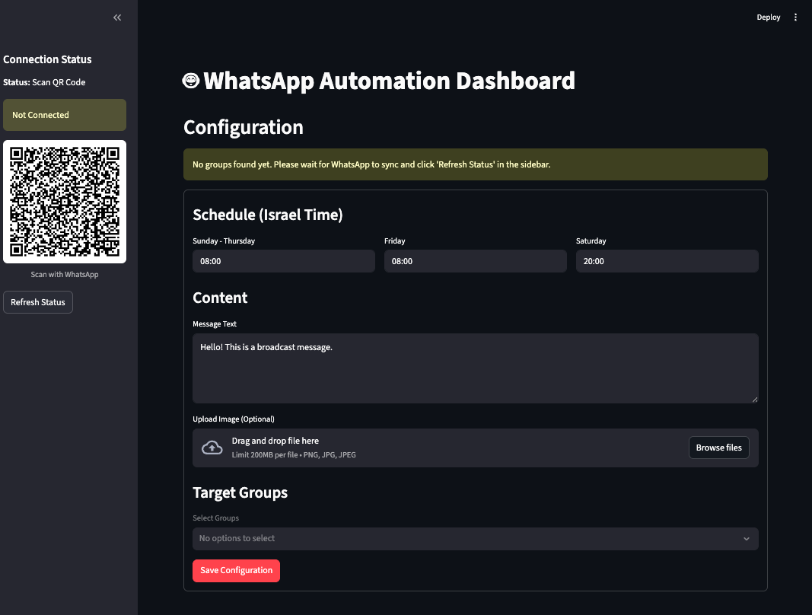

# WhatsApp Automation Suite

[English](#english) | [עברית](#hebrew)

---

<div id="english"></div>

## English

### Project Description

A complete WhatsApp automation system running in Docker containers. This system allows for smart message management, scheduling, and automated responses through a user-friendly browser interface.

**Technology Stack:**
*   **Backend:** Node.js with `whatsapp-web.js` library for WhatsApp control.
*   **Frontend:** Python Streamlit for a visual management dashboard.
*   **Infrastructure:** Docker Compose for easy and fast environment management.



**Key Features:**
*   🚀 **Broadcasts:** Send messages to defined distribution lists.
*   ⏰ **Scheduled Messages:** Schedule future messages by date and time.
*   🤖 **Smart Triggers:** Execute automated actions (like adding to a group) in response to message reactions (emojis).
*   📊 **Logs & Status:** Real-time view of connection status and system actions.

### Installation Instructions

Installation is simple and only requires Docker to be installed on your machine.

1.  **Download the Project:**
    ```bash
    git clone <YOUR_REPO_URL>
    cd whatsapp-automation-suite
    ```

2.  **Run the System:**
    Run the following command in the terminal within the main directory:
    ```bash
    docker-compose up --build
    ```

3.  **Connect to WhatsApp:**
    *   Open your browser at: `http://localhost:8501`
    *   A QR code will appear in the terminal. Scan it with WhatsApp on your phone to connect.

<!-- TODO: Add a screenshot of the terminal with the QR Code or the login screen here -->

4.  **That's it!** The system is connected. You can start scheduling messages and managing automations via the interface.

---

<div id="hebrew"></div>

## 🇮🇱 עברית

### תיאור הפרויקט

מערכת אוטומציה מלאה לוואטסאפ, הרצה בתוך קונטיינרים (Docker). המערכת מאפשרת ניהול חכם של הודעות, תזמונים ותגובות אוטומטיות דרך ממשק דפדפן נוח.

**הטכנולוגיה:**
*   **Backend:** Node.js עם ספריית `whatsapp-web.js` לשליטה בוואטסאפ.
*   **Frontend:** Python Streamlit לדאשבורד ניהול ויזואלי.
*   **Infrastructure:** Docker Compose לניהול קל ומהיר של הסביבה.

<!-- TODO: הוסף כאן צילום מסך של הדאשבורד הראשי (מסך הסטטוס וההודעות האחרונות) -->

**פיצ'רים עיקריים:**
*   🚀 **שידורים (Broadcasts):** שליחת הודעות לרשימות תפוצה מוגדרות.
*   ⏰ **תזמון הודעות:** שליחת הודעות עתידיות לפי תאריך ושעה.
*   🤖 **טריגרים חכמים:** ביצוע פעולות אוטומטיות (כמו הוספה לקבוצה) כתגובה לאימוג'י (Reaction) על הודעה.
*   📊 **לוגים וסטטוס:** צפייה בזמן אמת בסטטוס החיבור ובפעולות המערכת.

### הוראות התקנה

ההתקנה פשוטה ודורשת רק ש-Docker יהיה מותקן על המחשב.

1.  **הורדת הפרויקט:**
    ```bash
    git clone <YOUR_REPO_URL>
    cd whatsapp-automation-suite
    ```

2.  **הרצת המערכת:**
    הריצו את הפקודה הבאה בטרמינל בתיקייה הראשית:
    ```bash
    docker-compose up --build
    ```

3.  **חיבור לוואטסאפ:**
    *   פתחו את הדפדפן בכתובת: `http://localhost:8501`
    *   במסוף (Terminal) יופיע קוד QR. סרקו אותו עם הוואטסאפ בטלפון שלכם כדי להתחבר.

<!-- TODO: הוסף כאן צילום מסך של הטרמינל עם ה-QR Code או של מסך ההתחברות -->

4.  **זהו!** המערכת מחוברת. ניתן להתחיל לתזמן הודעות ולנהל את האוטומציות דרך הממשק.
